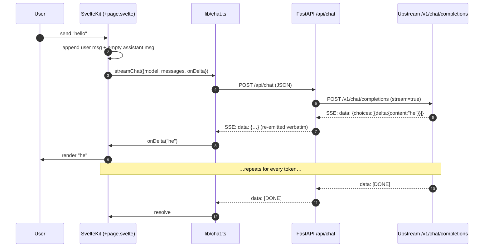

# free-webui

> A royalty-free, MIT-licensed, **clean-room** rewrite of the open-webui chat frontend for self-hosted LLMs.

`free-webui` is a from-scratch implementation of the same idea — a polished browser UI for talking to local and remote language models — with **no upstream code, no upstream license, no upstream branding**. It is built to be small, hackable, and free in every sense: free to fork, free to embed, free to ship inside a commercial product.

If `open-webui` is the kitchen-sink reference, `free-webui` aims to be the lean, opinionated alternative you can read in an afternoon.

---

## Status

**v0.0.1 — core chat only.** What works today:

- Streaming chat against any OpenAI-compatible endpoint (Ollama, vLLM, LM Studio, llama.cpp server, OpenAI itself)
- Model picker populated from the upstream's `/v1/models`
- In-memory conversation, "new chat" reset, mid-stream cancel
- Single-page SvelteKit frontend, FastAPI backend, Vite dev proxy

Explicitly **not** in this release: persistence, auth, multi-user, RAG, tools/function calling, attachments, web search, plugins, voice. Those land later, behind a stable core.

---

## Architecture

free-webui is a thin two-tier app. The frontend is a SvelteKit SPA. The backend is a stateless FastAPI proxy that normalizes one shape of upstream — the **OpenAI Chat Completions** wire format — and re-emits it to the browser as SSE.


### Request lifecycle (streaming chat)



### Why a backend proxy at all?

The browser could in principle talk to Ollama directly. We keep a backend because:

1. **CORS & secrets** — upstream API keys never reach the browser; CORS is centralized in one place.
2. **Wire normalization** — the frontend speaks one dialect (OpenAI SSE). Adding a non-OpenAI backend later (e.g., native Ollama, Anthropic, Bedrock) becomes a backend-only change.
3. **Future server-side state** — persistence, auth, rate limiting, and tool execution all belong on a server we control.

---

## Project layout

```
free-webui/
├── backend/
│   ├── app/
│   │   ├── __init__.py
│   │   ├── config.py        # pydantic-settings, env-driven config
│   │   ├── schemas.py       # ChatRequest / ChatMessage / ModelList
│   │   └── main.py          # FastAPI app: /api/health /api/models /api/chat
│   ├── pyproject.toml
│   ├── requirements.txt
│   └── .env.example
├── frontend/
│   ├── src/
│   │   ├── app.html
│   │   ├── app.d.ts
│   │   ├── lib/chat.ts      # SSE parser + streamChat() + listModels()
│   │   └── routes/
│   │       ├── +layout.svelte
│   │       └── +page.svelte # the chat UI
│   ├── static/favicon.svg
│   ├── package.json
│   ├── svelte.config.js
│   ├── tsconfig.json
│   └── vite.config.ts       # dev proxy /api → :8000
├── LICENSE                  # MIT
├── .gitignore
└── README.md
```

---

## Quick start

You'll need **Python ≥ 3.11**, **Node ≥ 20**, and an OpenAI-compatible LLM endpoint. The defaults assume [Ollama](https://ollama.com) running locally on `:11434`.

### 1. Start an upstream

```sh
# Option A: Ollama (exposes an OpenAI-compatible API at /v1)
ollama serve
ollama pull llama3.2

# Option B: any OpenAI-compatible server — vLLM, LM Studio, llama.cpp, OpenAI proper, …
```

### 2. Backend

```sh
cd backend
python -m venv .venv && source .venv/bin/activate
pip install -r requirements.txt
cp .env.example .env       # edit if your upstream isn't Ollama on localhost
uvicorn app.main:app --reload --port 8000
```

### 3. Frontend

```sh
cd frontend
npm install
npm run dev                # http://localhost:5173
```

Open <http://localhost:5173> and start chatting. The Vite dev server proxies `/api/*` to `:8000`, so there's no CORS dance in dev.

---

## Configuration

All backend config is environment-driven (prefix `FREE_WEBUI_`):

| Variable                          | Default                          | Meaning                                          |
| --------------------------------- | -------------------------------- | ------------------------------------------------ |
| `FREE_WEBUI_UPSTREAM_BASE_URL`    | `http://localhost:11434/v1`      | OpenAI-compatible base URL                       |
| `FREE_WEBUI_UPSTREAM_API_KEY`     | `ollama`                         | Bearer token sent to upstream                    |
| `FREE_WEBUI_DEFAULT_MODEL`        | `llama3.2`                       | Fallback when the request omits `model`          |
| `FREE_WEBUI_ALLOWED_ORIGINS`      | `["http://localhost:5173"]`      | CORS allow-list (JSON array)                     |

### Talking to OpenAI directly

```sh
export FREE_WEBUI_UPSTREAM_BASE_URL=https://api.openai.com/v1
export FREE_WEBUI_UPSTREAM_API_KEY=sk-…
export FREE_WEBUI_DEFAULT_MODEL=gpt-4o-mini
```

### Talking to vLLM

```sh
export FREE_WEBUI_UPSTREAM_BASE_URL=http://vllm.internal:8000/v1
export FREE_WEBUI_UPSTREAM_API_KEY=anything
export FREE_WEBUI_DEFAULT_MODEL=meta-llama/Llama-3.1-8B-Instruct
```

---

## API surface

| Method | Path           | Body                                         | Returns                                         |
| ------ | -------------- | -------------------------------------------- | ----------------------------------------------- |
| GET    | `/api/health`  | —                                            | `{"status":"ok"}`                               |
| GET    | `/api/models`  | —                                            | `{"data":[{"id":"llama3.2"}, …]}`               |
| POST   | `/api/chat`    | `{model?, messages:[{role,content}], …}`     | `text/event-stream` — OpenAI delta chunks + `[DONE]` |

The SSE payload is the upstream's OpenAI delta format, re-emitted verbatim. That keeps the parser in `frontend/src/lib/chat.ts` trivial and lets you swap the backend for a different proxy without changing the client.

---

## Roadmap

Rough order, no dates:

1. **Persistence** — SQLite for conversations + messages; sidebar with chat list.
2. **Multi-conversation routing** — `/chat/[id]` routes, deletion, rename.
3. **Markdown rendering** — code blocks with syntax highlighting, copy buttons.
4. **System prompts & per-chat parameters** — temperature, top-p, stop.
5. **Auth** — single-user password → multi-user with roles.
6. **Attachments** — image input for multimodal models.
7. **Tools / function calling** — server-side execution sandbox.
8. **RAG** — document upload, embeddings, retrieval.

Every step keeps the constraint: small, readable, MIT, no upstream code.

---

## Contributing

Because this is a clean-room rewrite, the one hard rule is: **do not copy code, assets, or strings from `open-webui` or any other non-MIT-compatible source.** Reference its UX, study its feature set, and re-implement independently.

Otherwise: PRs welcome. Keep diffs small, keep the dependency list short, and prefer deleting code to adding it.

---

## License

[MIT](./LICENSE).
