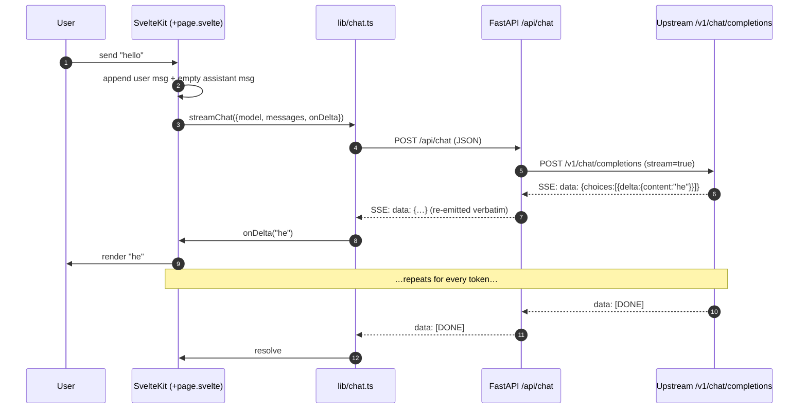

<p align="center">
  
</p>

<h1 align="center">free-webui</h1>

<p align="center">
  <a href="./LICENSE"></a>
  <a href="https://repostats.app/r/binRick/free-webui"></a>
  <a href="https://repostats.app/r/binRick/free-webui"></a>
  <a href="https://repostats.app/r/binRick/free-webui"></a>
</p>

<p align="center">
  A royalty-free, MIT-licensed, <strong>clean-room</strong> rewrite of the open-webui chat frontend for self-hosted LLMs.
</p>

`free-webui` is a from-scratch implementation of the same idea — a polished browser UI for talking to local and remote language models — with **no upstream code, no upstream license, no upstream branding**. It is built to be small, hackable, and free in every sense: free to fork, free to embed, free to ship inside a commercial product.

If `open-webui` is the kitchen-sink reference, `free-webui` aims to be the lean, opinionated alternative you can read in an afternoon.

---

## Screenshots

<p align="center">
  
  
</p>

<p align="center"><sub>dark / light themes share a CSS-var palette; shiki re-tokens code per theme</sub></p>

<p align="center">
  
  
  
</p>

<p align="center"><sub>per-chat settings drawer · first-run admin setup · responsive sidebar overlay at &lt; 768 px</sub></p>

<p align="center">
  
</p>

<p align="center"><sub>multimodal: paste / drop / pick images — sent as OpenAI multimodal content. Pair with a vision model (e.g. <code>llama3.2-vision</code>) to actually interpret them.</sub></p>

<p align="center">
  
</p>

<p align="center"><sub>RAG: upload docs in the settings drawer; the 📎 badge shows when RAG is active. Here the model correctly cites a fact from <code>product_notes.md</code> that never appeared in the visible message history.</sub></p>

---

## Status

**v0.0.1 — core chat only.** What works today:

- Streaming chat against any OpenAI-compatible endpoint (Ollama, vLLM, LM Studio, llama.cpp server, OpenAI itself)
- Model picker populated from the upstream's `/v1/models`
- In-memory conversation, "new chat" reset, mid-stream cancel
- Single-page SvelteKit frontend, FastAPI backend, Vite dev proxy

Explicitly **not** in this release: persistence, auth, multi-user, RAG, tools/function calling, attachments, web search, plugins, voice. Those land later, behind a stable core.

---

## Architecture

free-webui is a thin two-tier app. The frontend is a SvelteKit SPA. The backend is a stateless FastAPI proxy that normalizes one shape of upstream — the **OpenAI Chat Completions** wire format — and re-emits it to the browser as SSE.


### Request lifecycle (streaming chat)



### Why a backend proxy at all?

The browser could in principle talk to Ollama directly. We keep a backend because:

1. **CORS & secrets** — upstream API keys never reach the browser; CORS is centralized in one place.
2. **Wire normalization** — the frontend speaks one dialect (OpenAI SSE). Adding a non-OpenAI backend later (e.g., native Ollama, Anthropic, Bedrock) becomes a backend-only change.
3. **Future server-side state** — persistence, auth, rate limiting, and tool execution all belong on a server we control.

---

## Project layout

```
free-webui/
├── backend/
│   ├── app/
│   │   ├── __init__.py
│   │   ├── config.py        # pydantic-settings, env-driven config
│   │   ├── schemas.py       # ChatRequest / ChatMessage / ModelList
│   │   └── main.py          # FastAPI app: /api/health /api/models /api/chat
│   ├── pyproject.toml
│   ├── requirements.txt
│   └── .env.example
├── frontend/
│   ├── src/
│   │   ├── app.html
│   │   ├── app.d.ts
│   │   ├── lib/chat.ts      # SSE parser + streamChat() + listModels()
│   │   └── routes/
│   │       ├── +layout.svelte
│   │       └── +page.svelte # the chat UI
│   ├── static/favicon.svg
│   ├── package.json
│   ├── svelte.config.js
│   ├── tsconfig.json
│   └── vite.config.ts       # dev proxy /api → :8000
├── LICENSE                  # MIT
├── .gitignore
└── README.md
```

---

## Quick start

You'll need **Python ≥ 3.11**, **Node ≥ 20**, and an OpenAI-compatible LLM endpoint. The defaults assume [Ollama](https://ollama.com) running locally on `:11434`.

### 1. Start an upstream

```sh
# Option A: Ollama (exposes an OpenAI-compatible API at /v1)
ollama serve
ollama pull llama3.2

# Option B: any OpenAI-compatible server — vLLM, LM Studio, llama.cpp, OpenAI proper, …
```

### 2. Backend

```sh
cd backend
python -m venv .venv && source .venv/bin/activate
pip install -r requirements.txt
cp .env.example .env       # edit if your upstream isn't Ollama on localhost
uvicorn app.main:app --reload --port 8000
```

### 3. Frontend

```sh
cd frontend
npm install
npm run dev                # http://localhost:5173
```

Open <http://localhost:5173> and start chatting. The Vite dev server proxies `/api/*` to `:8000`, so there's no CORS dance in dev.

---

## Configuration

All backend config is environment-driven (prefix `FREE_WEBUI_`):

| Variable                          | Default                          | Meaning                                          |
| --------------------------------- | -------------------------------- | ------------------------------------------------ |
| `FREE_WEBUI_UPSTREAM_BASE_URL`    | `http://localhost:11434/v1`      | OpenAI-compatible base URL                       |
| `FREE_WEBUI_UPSTREAM_API_KEY`     | `ollama`                         | Bearer token sent to upstream                    |
| `FREE_WEBUI_DEFAULT_MODEL`        | `llama3.2`                       | Fallback when the request omits `model`          |
| `FREE_WEBUI_ALLOWED_ORIGINS`      | `["http://localhost:5173"]`      | CORS allow-list (JSON array)                     |

### Talking to OpenAI directly

```sh
export FREE_WEBUI_UPSTREAM_BASE_URL=https://api.openai.com/v1
export FREE_WEBUI_UPSTREAM_API_KEY=sk-…
export FREE_WEBUI_DEFAULT_MODEL=gpt-4o-mini
```

### Talking to vLLM

```sh
export FREE_WEBUI_UPSTREAM_BASE_URL=http://vllm.internal:8000/v1
export FREE_WEBUI_UPSTREAM_API_KEY=anything
export FREE_WEBUI_DEFAULT_MODEL=meta-llama/Llama-3.1-8B-Instruct
```

---

## API surface

| Method | Path | Body | Returns |
| ------ | ---- | ---- | ------- |
| GET    | `/api/health` | — | `{"status":"ok"}` |
| GET    | `/api/models` | — | `{"data":[{"id":"llama3.2"}, …]}` |
| GET    | `/api/auth/status` | — | `{user?, setup_required}` |
| POST   | `/api/auth/setup` | `{username, password}` | `User` (sets cookie) — first-user only |
| POST   | `/api/auth/login` | `{username, password}` | `User` (sets cookie) |
| POST   | `/api/auth/logout` | — | 204 |
| GET    | `/api/auth/me` | — | `User` |
| GET    | `/api/conversations` | — | `[ConversationSummary]` (non-empty, scoped to user) |
| POST   | `/api/conversations` | `{model?}` | `ConversationSummary` |
| GET    | `/api/conversations/{id}` | — | `Conversation` (with messages + params) |
| PATCH  | `/api/conversations/{id}` | `{title?, model?, system_prompt?, temperature?, top_p?, stop?}` | `Conversation` |
| DELETE | `/api/conversations/{id}` | — | 204 |
| POST   | `/api/conversations/{id}/messages` | `{content: string \| ContentPart[], model?}` | SSE — OpenAI delta + `[DONE]` |
| POST   | `/api/conversations/{id}/regenerate` | `{model?}` | SSE — drops last assistant, re-streams |
| PATCH  | `/api/conversations/{id}/messages/{msg_id}` | `{content, model?}` | SSE — truncates + re-streams |
| GET    | `/api/conversations/{id}/documents` | — | `[Document]` |
| POST   | `/api/conversations/{id}/documents` | `multipart file=` | `Document` (parses, chunks, embeds, stores) |
| DELETE | `/api/conversations/{id}/documents/{doc_id}` | — | 204 |

The SSE payload is the upstream's OpenAI delta format, re-emitted verbatim, so the frontend parser stays trivial and the backend can be swapped for a different proxy without changing the client.

---

## Roadmap

We're aiming at the 95% workflow people actually want from open-webui — not strict feature parity. Tiered by what's table-stakes vs nice-to-have.

### Tier 1 — feels like a real chat app

- ✅ **Persistence** — SQLite for conversations + messages.
- ✅ **Sidebar with conversation list** — create / open / delete; auto-titled from first user message.
- ✅ **Markdown rendering** — fenced code with shiki syntax highlighting + copy; tables; sanitized (DOMPurify). LaTeX + mermaid as follow-ups.
- ✅ **Edit + regenerate messages** — in-place edit on any user message truncates everything after and re-streams; regenerate replays the last assistant turn. Proper branching is a follow-up.
- ✅ **Per-chat parameters** — model, temperature, top-p, system prompt, stop sequences via a settings drawer + `PATCH /api/conversations/{id}`.
- ✅ **Mobile / responsive layout + dark/light themes** — CSS-var theming (system / light / dark, persisted), shiki dual-theme highlighting, sidebar slides over content on narrow viewports.
- **"Continue" affordance** — deferred: no clean cross-provider API for true continuation (most upstreams don't support an assistant-prefix mode); revisit per-provider later.

### Tier 2 — the things people pick open-webui *for*

- ✅ **Auth** — first-run `/setup` creates an admin (argon2id hashing); signed HTTP-only cookie session; all conversation routes are scoped per-user. Additional users via direct DB insert for now (admin UI is a follow-up). OAuth deferred.
- ✅ **RAG** — per-chat document upload (txt / md / pdf / common code files), fixed-size chunking with overlap, embeddings via the upstream's OpenAI-compatible `/v1/embeddings` (default model: `nomic-embed-text`), float32 BLOB storage, brute-force cosine retrieval, retrieved excerpts prepended as a system message every turn. Settings drawer shows attached docs + a 📎 N badge appears in the chat header when RAG is active.
- **Web search** — pluggable providers (SearXNG, Brave, Tavily, Google PSE) with citations.
- ✅ **Multimodal input** — paste / drop / pick images in the composer; sent as OpenAI multimodal content arrays (`{type:"text"}` + `{type:"image_url"}`) and persisted as JSON. Use any vision model (Ollama `llama3.2-vision`, `qwen2.5-vl`, OpenAI `gpt-4o`, etc.) to actually interpret them.
- **Voice** — STT for input, TTS for output.
- **Model management** — list / pull / delete Ollama models from the UI; multiple upstream connections.
- **Custom presets / "modelfiles"** — saved (model, system prompt, params) bundles.
- **Tools / function calling** — server-side registry + execution; MCP server support.
- **Memories** — long-lived facts persisted across conversations.
- **Prompt library** — saved reusable prompts with variables.
- **Share / export** — public share links; JSON / Markdown export; ChatGPT-format import.
- **OpenAI-compatible API of our own** — let other clients hit free-webui as if it were OpenAI.

### Tier 3 — larger initiatives, mostly skippable

Image generation (A1111 / ComfyUI / DALL-E), code interpreter sandbox, Pipelines / plugin framework, evaluation / leaderboard, channels / spaces, LDAP / SAML, full i18n, PWA install, admin panel.

### Constraint

Every step stays small, readable, MIT, with **no upstream code**.

---

## Contributing

Because this is a clean-room rewrite, the one hard rule is: **do not copy code, assets, or strings from `open-webui` or any other non-MIT-compatible source.** Reference its UX, study its feature set, and re-implement independently.

Otherwise: PRs welcome. Keep diffs small, keep the dependency list short, and prefer deleting code to adding it.

---

## License

[MIT](./LICENSE).
