<p align="center">
  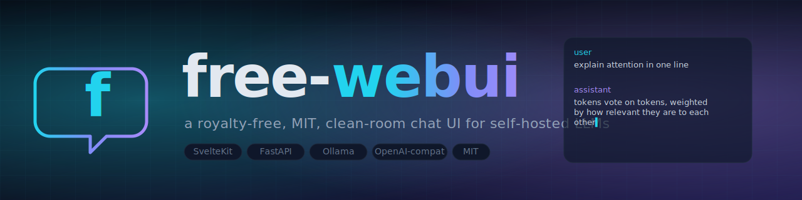
</p>

<h1 align="center">free-webui</h1>

<p align="center">
  <a href="./LICENSE"></a>
  <a href="https://repostats.app/r/binRick/free-webui"></a>
  <a href="https://repostats.app/r/binRick/free-webui"></a>
  <a href="https://repostats.app/r/binRick/free-webui"></a>
</p>

<p align="center">
  A royalty-free, MIT-licensed, <strong>clean-room</strong> rewrite of the open-webui chat frontend for self-hosted LLMs.
</p>

`free-webui` is a from-scratch implementation of the same idea — a polished browser UI for talking to local and remote language models — with **no upstream code, no upstream license, no upstream branding**. It is built to be small, hackable, and free in every sense: free to fork, free to embed, free to ship inside a commercial product.

If `open-webui` is the kitchen-sink reference, `free-webui` aims to be the lean, opinionated alternative you can read in an afternoon.

---

## Screenshots

<p align="center">
  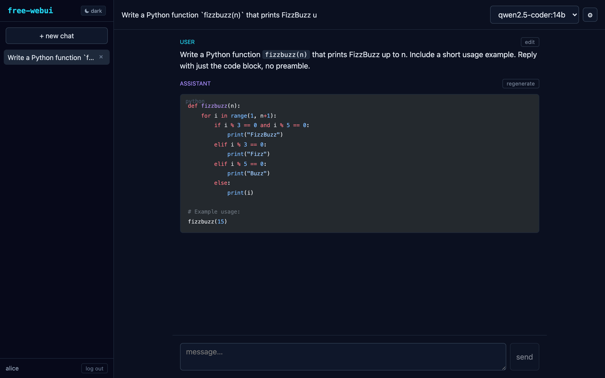
  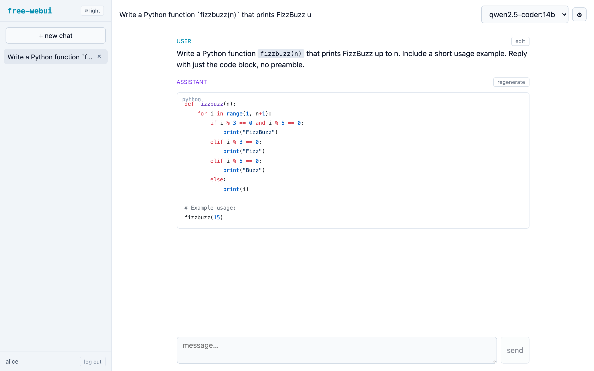
</p>

<p align="center"><sub>dark / light themes share a CSS-var palette; shiki re-tokens code per theme</sub></p>

<p align="center">
  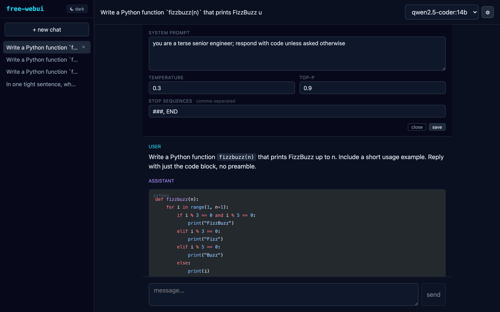
  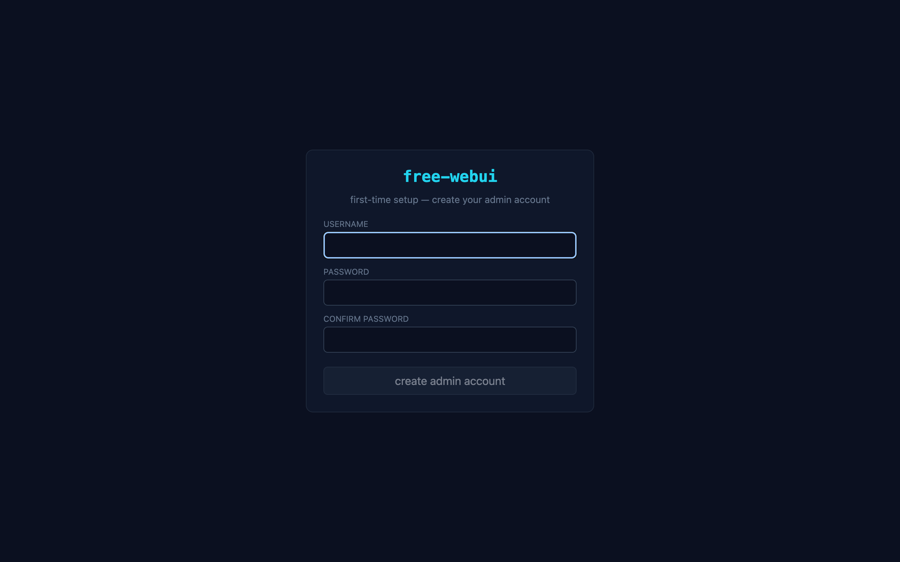
  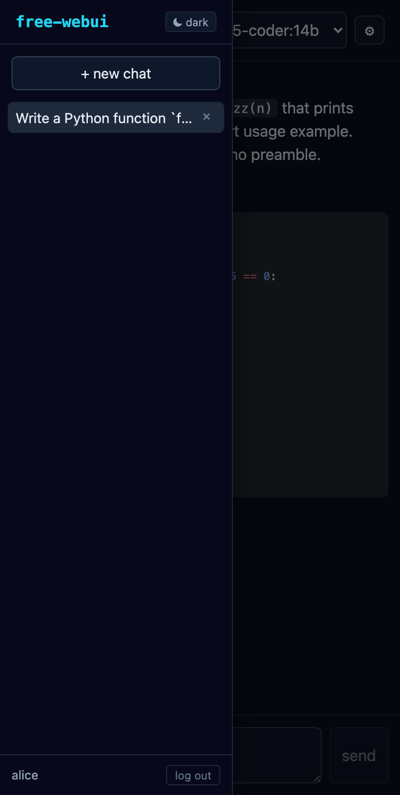
</p>

<p align="center"><sub>per-chat settings drawer · first-run admin setup · responsive sidebar overlay at &lt; 768 px</sub></p>

<p align="center">
  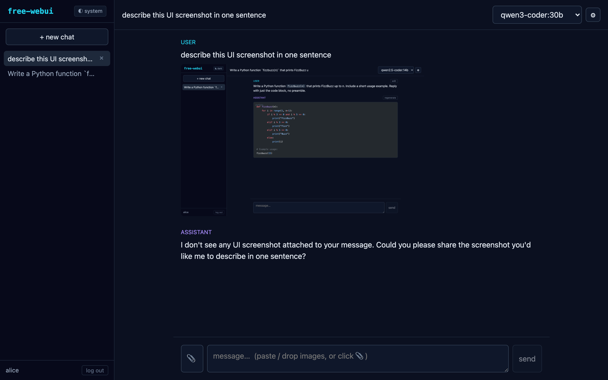
</p>

<p align="center"><sub>multimodal: paste / drop / pick images — sent as OpenAI multimodal content. Pair with a vision model (e.g. <code>llama3.2-vision</code>) to actually interpret them.</sub></p>

<p align="center">
  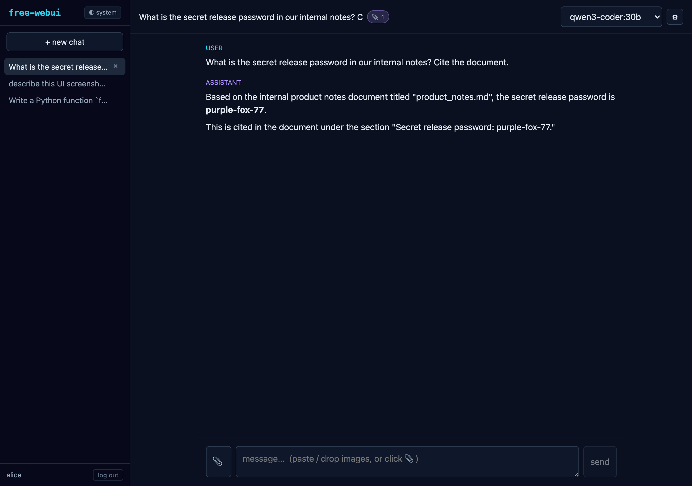
</p>

<p align="center"><sub>RAG: upload docs in the settings drawer; the 📎 badge shows when RAG is active. Here the model correctly cites a fact from <code>product_notes.md</code> that never appeared in the visible message history.</sub></p>

<p align="center">
  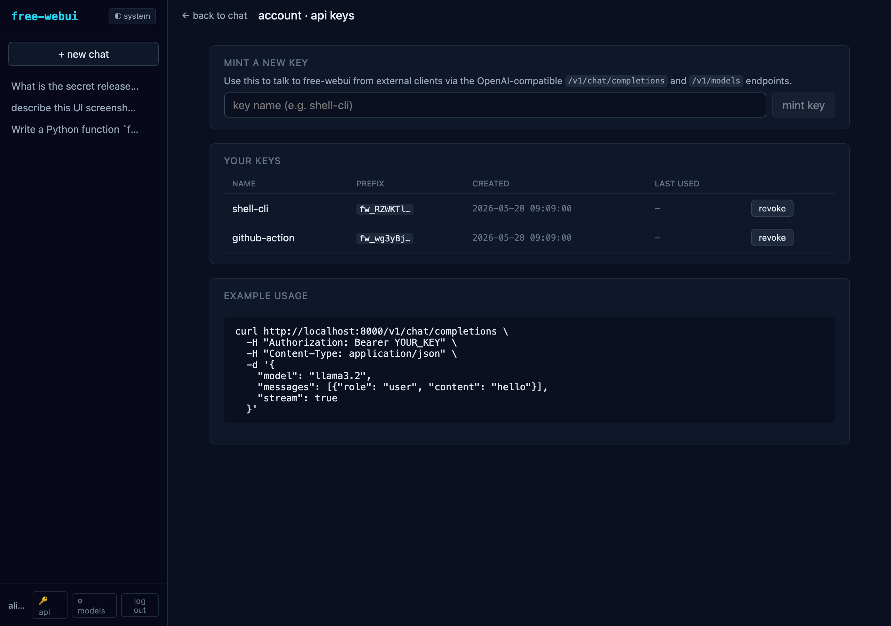
  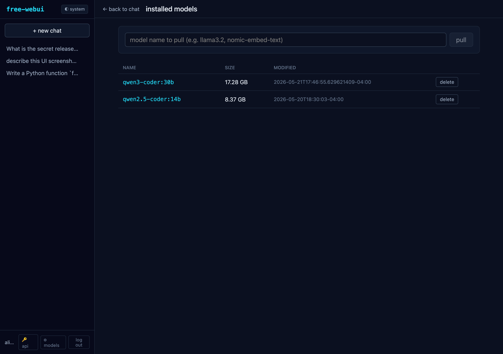
</p>

<p align="center"><sub>per-user API keys (Bearer auth for the OpenAI-compatible <code>/v1/*</code> surface) · admin-only Ollama model list with streaming pull / delete</sub></p>

<p align="center">
  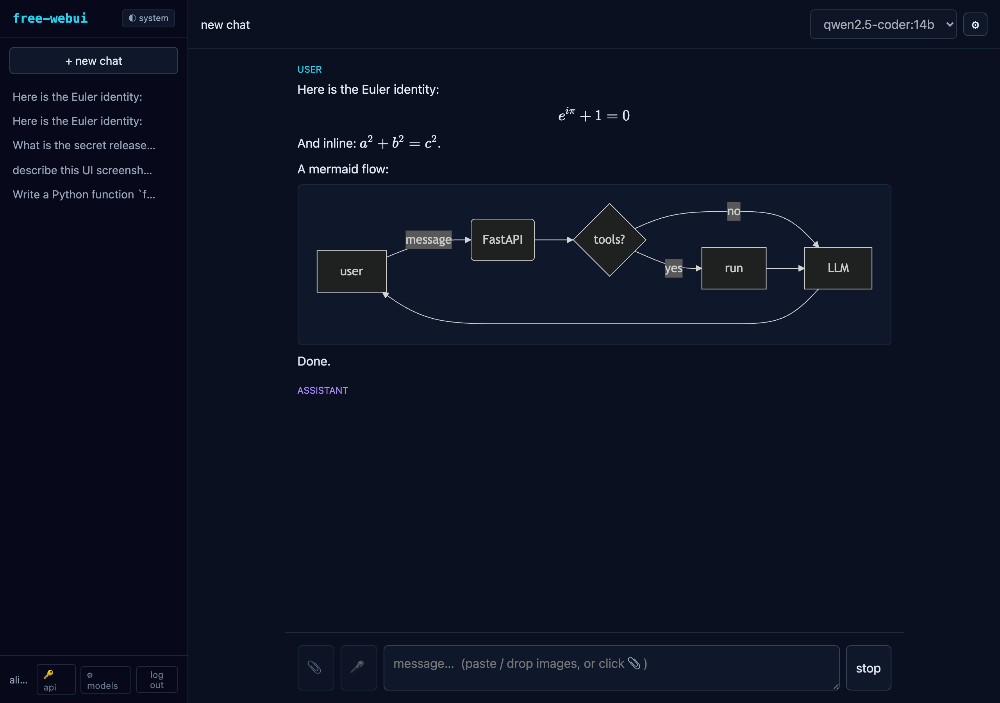
</p>

<p align="center"><sub>KaTeX math (<code>$inline$</code> + <code>$$display$$</code>) and mermaid flowcharts render inline; mermaid is lazy-loaded the first time a diagram appears.</sub></p>

---

## Status

**v0.1 — a full self-host chat platform.** Built on a SvelteKit SPA + FastAPI
backend, running on **SQLite (zero-config default) or Postgres**, with a
320+-test backend suite that runs against **both** backends in CI. What works today:

- **Chat** — streaming against any OpenAI-compatible upstream (Ollama, vLLM, LM
  Studio, llama.cpp, OpenAI); persistence; sidebar with search, date grouping,
  rename, **pin/archive**, **tags + folders**; **searchable model picker**;
  in-composer **`/` prompts · `@` models · `#` knowledge** commands +
  **`{{variable}}` prompt inputs**; markdown (shiki/KaTeX/mermaid); edit +
  **regenerate any turn** + **delete** + **continue** with non-destructive
  variant navigation (`◀ n/m ▶`); **clone**; **temporary (unsaved) chat** and a
  **compare-models** view; per-chat params incl. `max_tokens`/penalties/seed;
  **LLM auto-titling**; copy + 👍/👎 per message.
- **Knowledge** — per-chat RAG uploads **and reusable knowledge-base collections**
  attachable to any conversation; SearXNG web search; multimodal image input; a
  blob **object store** (generated/uploaded images served via `/api/files/{id}`
  instead of base64-in-DB); a per-user markdown **notes** workspace.
- **Tools** — function-calling loop with built-ins, **MCP servers**, **OpenAPI
  tool servers**, image generation (OpenAI/A1111/ComfyUI), a sandboxed
  `run_python` code interpreter, custom assistants (presets bundling
  model+persona+tools+knowledge), and a plugin/pipeline framework.
- **Multi-user** — argon2 auth, **OIDC/SSO**, server-side session revocation,
  user **groups + per-model access control**, admin user management, **audit
  log**, **feedback log**, a **usage-analytics dashboard**, and **broadcast
  banners**; mid-session expiry redirects to login instead of breaking.
- **Connectivity** — **multiple upstream connections** (per-model routing); an
  own OpenAI-compatible `/v1` surface (chat/models/embeddings) **and an Anthropic
  `/v1/messages` proxy** (Claude Code / the Anthropic SDK can target free-webui);
  per-user API keys.
- **Sharing & collaboration** — conversation export (JSON/Markdown), **public
  read-only share links**, and **real-time channels** (shared multi-user rooms
  over WebSocket: live messages, presence, typing); memories; prompt/preset
  libraries; server or browser voice; PWA.

Security-sensitive features (auth/access/connections/OIDC, the object store, the
Postgres backend, channels, OpenAPI tools) were each shipped with adversarial
multi-agent review. See [`docs/ROADMAP.md`](./docs/ROADMAP.md) for what's done vs.
planned and [`docs/SCALING.md`](./docs/SCALING.md) for the Postgres/scaling work.

## Compared to open-webui

free-webui is a clean-room, MIT-licensed reimplementation. It targets parity on
the **product** — the day-to-day chat, knowledge, tools, and multi-user surface —
while deliberately staying a lean two-tier app. Roughly:

**At parity** ✅

| Area | free-webui |
| --- | --- |
| Chat core | streaming, markdown (code/KaTeX/mermaid), edit, **regenerate any turn**, **continue**, branching/variants, copy, 👍/👎, auto-titling, follow-ups |
| Organization | search, date grouping, pin/archive, **tags**, **folders**, **clone**, **temporary chat** |
| Composer | searchable model picker, `/`·`@`·`#` commands, **prompt variables** with custom input |
| Knowledge / RAG | per-chat uploads, **URL ingest** (fetch a web page/PDF), reusable **collections**, web search, **inline citations + hovercards**, **hybrid dense+BM25 retrieval** (RRF) |
| Tools | function-calling loop, **MCP**, **OpenAPI tool servers**, code interpreter, image generation, custom assistants, plugins/pipelines |
| Models | **multiple upstream connections**, Ollama model management, per-model access control, per-chat params |
| Multi-user / admin | argon2 auth, **OIDC/SSO**, groups + RBAC, **per-feature permission matrix**, audit log, feedback log, **usage analytics**, **broadcast banners**, self-service **data export + account deletion** |
| Evaluation | **arena** (blind A/B vote → ELO), feedback-driven **leaderboard** (Wilson-scored) |
| Collaboration | **real-time channels** (WebSocket), **notes**, public share links, **multi-model compare** |
| Voice | server-side STT/TTS proxy + browser Web Speech fallback, **hands-free voice/video call mode** (VAD turn-taking, optional camera→vision) |
| API | OpenAI-compatible `/v1`, **Anthropic `/v1/messages` proxy**, per-user API keys |
| Deployment | **SQLite or Postgres** (full suite green on both), optional **S3/MinIO** media storage |

**Partial / weaker** ⚠️

- **RAG retrieval** — **hybrid** dense (numpy-vectorized cosine) + sparse
  (BM25 keyword) retrieval fused with Reciprocal Rank Fusion, so exact-term
  matches (names, IDs, code symbols) surface alongside semantic ones. Still a
  brute-force scan — no ANN index yet (would add `sqlite-vec` for >100k chunks).
- **Horizontal scaling** — Postgres is supported and real-time **channels now
  fan out across replicas via Redis pub/sub** (`FREE_WEBUI_REDIS_URL`); the
  remaining in-process bits (login limiter, per-user WS cap / presence count) and
  the per-request connection pool are the rest of Phase-2 in `docs/SCALING.md`.
- **i18n** — a dependency-free foundation is in place (reactive `t()` + JSON
  catalogs, **en/es/fr/de**, in-app language switcher); UI-string coverage is
  partial (sidebar + login wired, the rest adopting `t()` incrementally).
  open-webui ships dozens of fully-translated languages.

**Missing** ❌ (open-webui has these; free-webui does not yet)

- **Enterprise auth** — LDAP / SCIM.
- Assorted polish: custom CSS/theming beyond light/dark.

Net: strong parity for everyday single- / small-team self-hosting (now including
Postgres); the meaningful remaining distance is **i18n breadth**, the
**evaluation suite**, and **multi-replica horizontal scaling**.

---

## Architecture

free-webui is a thin two-tier app. The frontend is a SvelteKit SPA. The backend is a stateless FastAPI proxy that normalizes one shape of upstream — the **OpenAI Chat Completions** wire format — and re-emits it to the browser as SSE.

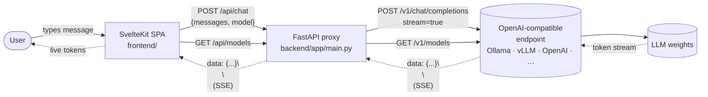

### Request lifecycle (streaming chat)

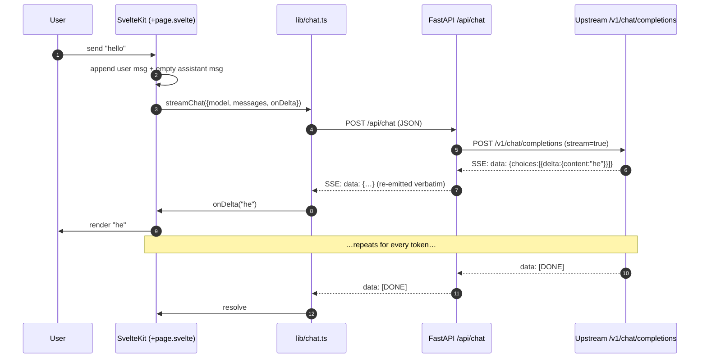

### Why a backend proxy at all?

The browser could in principle talk to Ollama directly. We keep a backend because:

1. **CORS & secrets** — upstream API keys never reach the browser; CORS is centralized in one place.
2. **Wire normalization** — the frontend speaks one dialect (OpenAI SSE). Adding a non-OpenAI backend later (e.g., native Ollama, Anthropic, Bedrock) becomes a backend-only change.
3. **Future server-side state** — persistence, auth, rate limiting, and tool execution all belong on a server we control.

---

## Project layout

```
free-webui/
├── backend/
│   ├── app/
│   │   ├── __init__.py
│   │   ├── config.py        # pydantic-settings, env-driven config
│   │   ├── schemas.py       # ChatRequest / ChatMessage / ModelList
│   │   └── main.py          # FastAPI app: /api/health /api/models /api/chat
│   ├── pyproject.toml
│   ├── requirements.txt
│   └── .env.example
├── frontend/
│   ├── src/
│   │   ├── app.html
│   │   ├── app.d.ts
│   │   ├── lib/chat.ts      # SSE parser + streamChat() + listModels()
│   │   └── routes/
│   │       ├── +layout.svelte
│   │       └── +page.svelte # the chat UI
│   ├── static/favicon.svg
│   ├── package.json
│   ├── svelte.config.js
│   ├── tsconfig.json
│   └── vite.config.ts       # dev proxy /api → :8000
├── LICENSE                  # MIT
├── .gitignore
└── README.md
```

---

## Quick start

You'll need **Python ≥ 3.11**, **Node ≥ 20**, and an OpenAI-compatible LLM endpoint. The defaults assume [Ollama](https://ollama.com) running locally on `:11434`.

### 1. Start an upstream

```sh
# Option A: Ollama (exposes an OpenAI-compatible API at /v1)
ollama serve
ollama pull llama3.2

# Option B: any OpenAI-compatible server — vLLM, LM Studio, llama.cpp, OpenAI proper, …
```

### 2. Backend

```sh
cd backend
python -m venv .venv && source .venv/bin/activate
pip install -r requirements.txt
cp .env.example .env       # edit if your upstream isn't Ollama on localhost
uvicorn app.main:app --reload --port 8000
```

### 3. Frontend

```sh
cd frontend
npm install
npm run dev                # http://localhost:5173
```

Open <http://localhost:5173> and start chatting. The Vite dev server proxies `/api/*` to `:8000`, so there's no CORS dance in dev.

---

## Configuration

All backend config is environment-driven (prefix `FREE_WEBUI_`):

| Variable                          | Default                          | Meaning                                          |
| --------------------------------- | -------------------------------- | ------------------------------------------------ |
| `FREE_WEBUI_UPSTREAM_BASE_URL`    | `http://localhost:11434/v1`      | OpenAI-compatible base URL                       |
| `FREE_WEBUI_UPSTREAM_API_KEY`     | `ollama`                         | Bearer token sent to upstream                    |
| `FREE_WEBUI_DEFAULT_MODEL`        | `llama3.2`                       | Fallback when the request omits `model`          |
| `FREE_WEBUI_ALLOWED_ORIGINS`      | `["http://localhost:5173"]`      | CORS allow-list (JSON array)                     |
| `FREE_WEBUI_IMAGE_BACKEND`        | _(empty — disabled)_             | `openai` \| `automatic1111` \| `comfyui` — enables the `imagine` tool |
| `FREE_WEBUI_IMAGE_BASE_URL`       | _(empty)_                        | Image backend base URL (e.g. `http://localhost:7860`) |
| `FREE_WEBUI_IMAGE_API_KEY`        | _(empty)_                        | Bearer token for the `openai` image backend      |
| `FREE_WEBUI_IMAGE_MODEL`          | `dall-e-3`                       | OpenAI model id / SD checkpoint name             |
| `FREE_WEBUI_CODE_INTERPRETER`     | _(empty — disabled)_             | `docker` \| `subprocess` \| `auto` — enables `run_python` |
| `FREE_WEBUI_CODE_DOCKER_IMAGE`    | `python:3-alpine`                | Image used by the `docker` code-interpreter backend |
| `FREE_WEBUI_CODE_TIMEOUT_SECONDS` | `15`                             | Wall-clock limit per code execution              |
| `FREE_WEBUI_PLUGINS_DIR`          | _(empty — disabled)_             | Directory of operator-installed `*.py` plugin modules (inlet/outlet hooks) — enables the plugin framework |
| `FREE_WEBUI_PLUGINS_TIMEOUT_SECONDS` | `5.0`                         | Per-hook wall-clock cap before a plugin is skipped |

### Talking to OpenAI directly

```sh
export FREE_WEBUI_UPSTREAM_BASE_URL=https://api.openai.com/v1
export FREE_WEBUI_UPSTREAM_API_KEY=sk-…
export FREE_WEBUI_DEFAULT_MODEL=gpt-4o-mini
```

### Talking to vLLM

```sh
export FREE_WEBUI_UPSTREAM_BASE_URL=http://vllm.internal:8000/v1
export FREE_WEBUI_UPSTREAM_API_KEY=anything
export FREE_WEBUI_DEFAULT_MODEL=meta-llama/Llama-3.1-8B-Instruct
```

### Image generation

Set a backend to expose the built-in `imagine` tool. Pick one:

```sh
# OpenAI Images (DALL·E / gpt-image-compatible)
export FREE_WEBUI_IMAGE_BACKEND=openai
export FREE_WEBUI_IMAGE_BASE_URL=https://api.openai.com/v1
export FREE_WEBUI_IMAGE_API_KEY=sk-…
export FREE_WEBUI_IMAGE_MODEL=dall-e-3

# AUTOMATIC1111 (local Stable Diffusion WebUI, --api)
export FREE_WEBUI_IMAGE_BACKEND=automatic1111
export FREE_WEBUI_IMAGE_BASE_URL=http://localhost:7860

# ComfyUI (headless; point at your own API-format workflow export)
export FREE_WEBUI_IMAGE_BACKEND=comfyui
export FREE_WEBUI_IMAGE_BASE_URL=http://localhost:8188
export FREE_WEBUI_COMFYUI_WORKFLOW_PATH=/path/to/workflow.json   # optional; %prompt% %negative_prompt% %width% %height% %seed% %steps% substituted
```

With a backend set and the per-chat **tools** toggle on, asking the model to "draw…" / "generate an image of…" triggers `imagine`; the picture is generated server-side, streamed to the chat as it lands, and saved with the conversation.

### Code interpreter

Expose the built-in `run_python` tool. **Prefer the `docker` backend** — it is a real sandbox (no network, read-only rootfs, non-root user, dropped capabilities, memory/cpu/pid limits), so executed code can't reach the host DB or secret key:

```sh
export FREE_WEBUI_CODE_INTERPRETER=docker        # or: auto (docker if present, else subprocess)
export FREE_WEBUI_CODE_DOCKER_IMAGE=python:3-alpine   # use a custom image for libs (e.g. matplotlib)
export FREE_WEBUI_CODE_TIMEOUT_SECONDS=15
```

The `subprocess` backend runs code as a same-host child with timeouts, POSIX rlimits, and a stripped environment, but **is not a security boundary** (the code can read the host filesystem) — use it only for trusted, single-user deployments. Saved image files (e.g. `plt.savefig('plot.png')`) are surfaced to the chat just like generated images.

### Server-side voice (STT / TTS)

Point the audio proxies at any OpenAI-compatible audio backend. Leave a base URL unset to disable that direction (the client then uses the browser Web Speech API):

```sh
# speech-to-text (Whisper /audio/transcriptions)
export FREE_WEBUI_AUDIO_STT_BASE_URL=https://api.openai.com/v1   # or a local faster-whisper-server / speaches
export FREE_WEBUI_AUDIO_STT_API_KEY=sk-...
export FREE_WEBUI_AUDIO_STT_MODEL=whisper-1
# text-to-speech (/audio/speech)
export FREE_WEBUI_AUDIO_TTS_BASE_URL=https://api.openai.com/v1   # or openai-edge-tts / kokoro
export FREE_WEBUI_AUDIO_TTS_API_KEY=sk-...
export FREE_WEBUI_AUDIO_TTS_MODEL=tts-1
export FREE_WEBUI_AUDIO_TTS_VOICE=alloy
```

The base URLs and keys are operator-only (never user-supplied), so there's no SSRF surface and the upstream key is never exposed to clients. Uploads are capped (`FREE_WEBUI_AUDIO_MAX_UPLOAD_BYTES`, default 25 MB) and TTS input is length-bounded.

### Plugins / pipelines

Point the backend at a directory of operator-installed Python modules to hook the chat flow:

```sh
export FREE_WEBUI_PLUGINS_DIR=backend/example_plugins   # empty = feature disabled
export FREE_WEBUI_PLUGINS_TIMEOUT_SECONDS=5             # per-hook wall-clock cap (default 5)
```

Each `*.py` file in that directory may expose one or both **async** hooks plus an optional module-level `PRIORITY`:

```python
PRIORITY = 10  # lower runs first on inlet; outlet runs in reverse

async def inlet(body: dict, ctx) -> dict | None:
    """Rewrite the outbound OpenAI request before it hits the upstream
    (model, temperature, top_p, stop, messages). Return the dict, or
    mutate it in place and return None."""
    if body.get("temperature", 0) > 1.2:
        body["temperature"] = 1.2
    return body

async def outlet(text: str, ctx) -> str | None:
    """Rewrite the final assistant text before it is persisted.
    Return the new string, or None to observe only."""
    return text.replace("secret", "[redacted]")
```

`ctx` carries `db`, `http`, `user_id`, `conversation_id`, and `model`. A working example ships at [`backend/example_plugins/clamp_and_redact.py`](backend/example_plugins/clamp_and_redact.py) (clamps temperature on the way in, redacts emails on the way out).

How it behaves:

- **Trust model** — plugins are operator-installed, **trusted, in-process** code with full backend access. This is the deliberate *inverse* of the sandboxed code interpreter; only load files you wrote or audited.
- **Ordering** — inlets run ascending by `(PRIORITY, name)`; outlets run in reverse so wrappers nest symmetrically.
- **Isolation** — every hook runs on a deep copy under a timeout in a try/except. A plugin that raises, times out, or returns the wrong type is logged and skipped — the turn proceeds exactly as if it weren't installed. To *block* a turn, a plugin must **rewrite** the body/text (e.g. to a refusal); raising never aborts.
- **Tool loop** — an inlet's edits are applied once and persist across every tool-loop iteration. Tools/`tool_choice` are owned by the loop, so inlet edits to those keys are ignored.
- **Outlet vs. stream** — the outlet rewrites only the *persisted* text; the live stream already went out verbatim, so the rewrite shows up on reload.
- **Async only** — hooks must be `async`; `asyncio.wait_for` cannot interrupt a *synchronous* blocking call, so do blocking work via `asyncio.to_thread`.

Loaded plugins (and any per-file load errors) are visible to admins at `GET /api/plugins`.

---

## API surface

| Method | Path | Body | Returns |
| ------ | ---- | ---- | ------- |
| GET    | `/api/health` | — | `{"status":"ok"}` |
| GET    | `/api/models` | — | `{"data":[{"id":"llama3.2"}, …]}` |
| GET    | `/api/auth/status` | — | `{user?, setup_required}` |
| POST   | `/api/auth/setup` | `{username, password}` | `User` (sets cookie) — first-user only |
| POST   | `/api/auth/login` | `{username, password}` | `User` (sets cookie) |
| POST   | `/api/auth/logout` | — | 204 |
| GET    | `/api/auth/me` | — | `User` |
| GET    | `/api/conversations` | — | `[ConversationSummary]` (non-empty, scoped to user) |
| POST   | `/api/conversations` | `{model?}` | `ConversationSummary` |
| GET    | `/api/conversations/{id}` | — | `Conversation` (with messages + params) |
| PATCH  | `/api/conversations/{id}` | `{title?, model?, system_prompt?, temperature?, top_p?, stop?}` | `Conversation` |
| DELETE | `/api/conversations/{id}` | — | 204 |
| POST   | `/api/conversations/{id}/messages` | `{content: string \| ContentPart[], model?}` | SSE — OpenAI delta + `[DONE]` |
| POST   | `/api/conversations/{id}/regenerate` | `{model?}` | SSE — drops last assistant, re-streams |
| PATCH  | `/api/conversations/{id}/messages/{msg_id}` | `{content, model?}` | SSE — truncates + re-streams |
| GET    | `/api/conversations/{id}/documents` | — | `[Document]` |
| POST   | `/api/conversations/{id}/documents` | `multipart file=` | `Document` (parses, chunks, embeds, stores) |
| DELETE | `/api/conversations/{id}/documents/{doc_id}` | — | 204 |
| GET    | `/api/plugins` | — | `[PluginRecord]` (admin-only: name, priority, has_inlet, has_outlet, error) |

The SSE payload is the upstream's OpenAI delta format, re-emitted verbatim, so the frontend parser stays trivial and the backend can be swapped for a different proxy without changing the client.

---

## Roadmap

We're aiming at the 95% workflow people actually want from open-webui — not strict feature parity. Tiered by what's table-stakes vs nice-to-have.

### Tier 1 — feels like a real chat app

- ✅ **Persistence** — SQLite for conversations + messages.
- ✅ **Sidebar with conversation list** — create / open / delete; auto-titled from first user message.
- ✅ **Markdown rendering** — fenced code with shiki syntax highlighting + copy; tables; LaTeX via KaTeX (`$inline$` + `$$display$$`); mermaid diagrams (lazy-loaded, theme-aware); sanitized through DOMPurify with html + svg + mathml profiles.
- ✅ **Edit + regenerate messages** — in-place edit on any user message truncates everything after and re-streams; regenerate replays the last assistant turn. Proper branching is a follow-up.
- ✅ **Per-chat parameters** — model, temperature, top-p, system prompt, stop sequences via a settings drawer + `PATCH /api/conversations/{id}`.
- ✅ **Mobile / responsive layout + dark/light themes** — CSS-var theming (system / light / dark, persisted), shiki dual-theme highlighting, sidebar slides over content on narrow viewports.
- ✅ **"Continue" affordance** — a trailing assistant reply that stopped early (e.g. cut off by `max_tokens`) can be continued: the partial reply is replayed as history with a continuation instruction and the new text is appended onto the same message. Portable across OpenAI-compatible upstreams (no provider-specific assistant-prefix API needed).

### Tier 2 — the things people pick open-webui *for*

- ✅ **Auth** — first-run `/setup` creates an admin (argon2id hashing); signed HTTP-only cookie session; all conversation routes are scoped per-user. Admin UI at `/admin/users` for create / promote / demote / reset-password / delete (with last-admin and self-delete guards). OAuth deferred.
- ✅ **Per-feature permissions** — admins gate what non-admin users may do (web search, image generation, code interpreter, file upload, external tools, knowledge, notes, temporary chat, share links) at `/admin/permissions`. Each capability defaults to allowed; turn a default off to restrict everyone, then grant it back to specific **groups** (effective = default OR group grant). Admins always bypass; enforced server-side at every surface.
- ✅ **RAG** — per-chat document upload (txt / md / pdf / common code files), fixed-size chunking with overlap, embeddings via the upstream's OpenAI-compatible `/v1/embeddings` (default model: `nomic-embed-text`), float32 BLOB storage, **numpy-vectorized cosine retrieval** (one matrix-vector product, ~18× faster than the former per-chunk loop), retrieved excerpts prepended as a system message every turn. Settings drawer shows attached docs + a 📎 N badge appears in the chat header when RAG is active.
- ✅ **Web search** — SearXNG-compatible provider. Per-chat toggle in the settings drawer; when on, the user's query is searched, top results' title/url/snippet are prepended as a system message, and a 🌐 web badge appears in the chat header. Brave / Tavily / Google PSE as follow-ups.
- ✅ **Multimodal input** — paste / drop / pick images in the composer; sent as OpenAI multimodal content arrays (`{type:"text"}` + `{type:"image_url"}`) and persisted as JSON. Use any vision model (Ollama `llama3.2-vision`, `qwen2.5-vl`, OpenAI `gpt-4o`, etc.) to actually interpret them.
- ✅ **Voice** — 🎤 mic button in the composer + 🔊 button on assistant messages. **Server-side STT/TTS** when configured: the mic records a clip (MediaRecorder) and posts it to a Whisper-style `/audio/transcriptions`; speak posts text to `/audio/speech` and plays the returned audio. Both proxy any OpenAI-compatible audio backend (OpenAI, faster-whisper-server, speaches, openai-edge-tts, kokoro, …) and **fall back to the browser Web Speech API** when unset.
- ✅ **Model management** — admin-only `/admin/models` page lists installed Ollama models, supports streaming `pull` (with progress bar) and `delete`. Backend proxies Ollama's native `/api/tags`, `/api/pull`, `/api/delete`. Multiple upstream connections deferred.
- ✅ **Custom presets / "modelfiles"** — per-user named bundles of (model, system_prompt, temperature, top_p, stop). "Save current" in the settings drawer captures the chat's params; "apply" copies them onto the current conversation.
- ✅ **Tools / function calling** — per-chat toggle. Built-in safe tools (`now()`, `calculate(expression)` via AST whitelist) plus per-user **MCP server support**: configure any JSON-RPC MCP endpoint at `/account/mcp`, its `tools/list` is merged into the catalogue (namespaced `mcp_<id>_<tool>`), and `tools/call` is fanned out during the loop. Backend runs the full OpenAI-style tool loop server-side: streams partial content, drains `tool_calls` deltas, executes locally or via MCP, surfaces each call as an `event: tool_call` SSE frame, feeds the result back, and continues — up to 5 loops per turn. Frontend renders 🔧 chips inline above the model's reply.
- ✅ **Memories** — per-user manually-curated facts in the settings drawer; prepended as a system message in every conversation alongside RAG and web-search context. LLM-based auto-extraction deferred.
- ✅ **Prompt library** — per-user CRUD; save the current composer text as a named prompt, click any saved prompt to insert. Variables deferred.
- ✅ **Conversation export** — JSON or Markdown download from the settings drawer. Public share links deferred.
- ✅ **OpenAI-compatible API of our own** — per-user Bearer-auth `/v1/chat/completions` and `/v1/models`. Mint and revoke keys from `/account`. The full hashed-secret never leaves the DB; the raw key is shown exactly once at mint time.

### Tier 3 — larger initiatives

- ✅ **KaTeX + mermaid in markdown** (initially deferred from Tier 1).
- ✅ **Admin panel** — user management at `/admin/users`.
- ✅ **PWA install** — `manifest.webmanifest`, service worker, theme color, SVG + PNG icons.
- ✅ **MCP server support** — per-user JSON-RPC MCP servers configured at `/account/mcp`; `tools/list` is auto-merged into the tool catalogue and `tools/call` is dispatched through the same tool loop.
- ✅ **Image generation** — built-in `imagine(prompt, size?, negative_prompt?)` tool that proxies OpenAI Images / AUTOMATIC1111 / ComfyUI (selected by `FREE_WEBUI_IMAGE_BACKEND`). It rides the existing tool loop: the model calls it, the backend generates the image, returns it as a `data:` URL surfaced over an `event: image` SSE frame, and persists it inside a multimodal assistant message so it survives reload — rendered by the same image-part path as uploaded images. Gated on config: the tool only appears when a backend is set. Disabled → no tool offered.
- ✅ **Code interpreter** — built-in `run_python(code)` tool (selected by `FREE_WEBUI_CODE_INTERPRETER`). The `docker` backend is a real sandbox (no network, read-only rootfs, non-root, dropped caps, mem/cpu/pid limits); a `subprocess` fallback adds timeouts + rlimits + a stripped env for trusted single-user use (not a security boundary). Code runs in a throwaway per-call workdir; raster images it writes (e.g. matplotlib plots) are surfaced + persisted via the same path as image generation. Gated on config.
- ✅ **Pipelines / plugin framework** — operator-installed `*.py` plugins in `FREE_WEBUI_PLUGINS_DIR`, each with async `inlet(body, ctx)` / `outlet(text, ctx)` hooks ordered by module-level `PRIORITY`. Trusted, in-process middleware (the deliberate inverse of the sandboxed code interpreter) that rewrites the outbound request and/or the persisted reply. Every hook runs on a deep copy under a timeout with passthrough-on-failure, so a broken plugin never breaks a turn; inlet edits survive the whole tool loop. Read-only admin listing at `GET /api/plugins`. Gated on config. (v2+ deferred: per-chunk `stream` hook, plugin-as-model `pipe`, typed admin/user valves, hot-reload.)

Skippable / not planned: LDAP / SAML, full i18n.

### Constraint

Every step stays small, readable, MIT, with **no upstream code**.

---

## Contributing

Because this is a clean-room rewrite, the one hard rule is: **do not copy code, assets, or strings from `open-webui` or any other non-MIT-compatible source.** Reference its UX, study its feature set, and re-implement independently.

Otherwise: PRs welcome. Keep diffs small, keep the dependency list short, and prefer deleting code to adding it.

---

## License

[MIT](./LICENSE).
